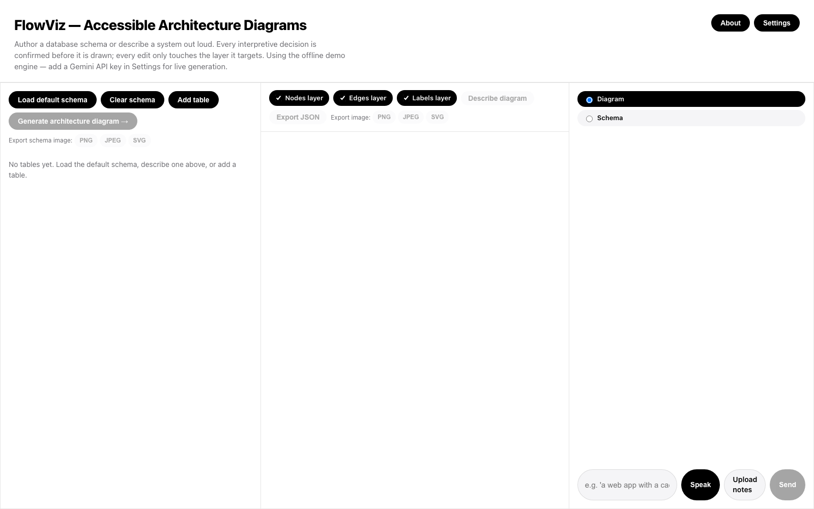
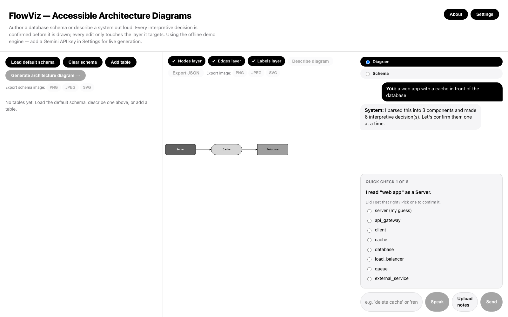
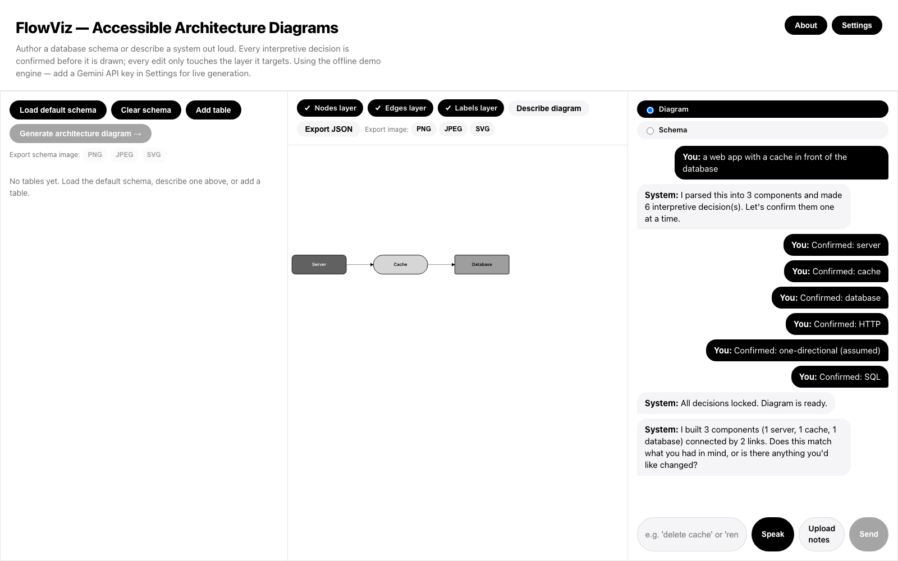
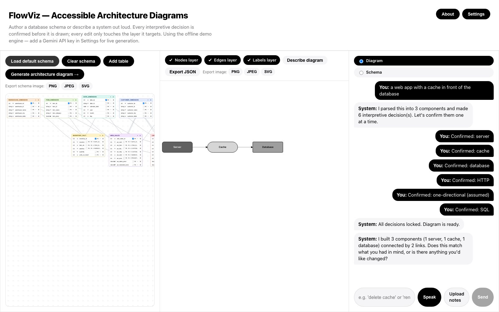

# FlowViz

FlowViz is a system-architecture and entity-relationship diagram tool built around a single
question: can a blind or low-vision (BLV) person draft one of these diagrams themselves,
instead of only having an existing one described to them after a sighted colleague made it.
It runs entirely in the browser, generates diagrams from a typed or spoken prompt or from a
pasted database schema, and never commits an interpretive decision (what type a component
is, which way an edge points, what a label implies) to the diagram without first stating it
in plain language and letting the user confirm or correct it.

[Live demo](https://sk-143381.github.io/flowviz/) &middot;
[Architecture reference](docs/architecture.md) &middot;
[Literature review and project plan](docs/write-up.md) &middot;
[Wiki (draft)](wiki/Home.md)

## Screenshots

| | |
|---|---|
|  |  |
| Three panes on load: schema editor, diagram canvas, chat/prompt. | The HCXAI confirmation dialogue, one decision at a time, before anything renders. |
|  |  |
| A confirmed diagram, three independently toggleable layers (nodes, edges, labels). | The schema pane's ER-diagram-style canvas: real form controls, not a picture. |

## What it actually does

- **Type or speak a prompt** ("a web app with a cache in front of the database") and get a
  draft diagram plus a list of every assumption the system made about it.
- **Confirm or contest each assumption**, one at a time, before the diagram is finalized.
  Contesting one swaps in the alternative and updates only what that decision affects.
- **Edit an existing diagram** ("delete cache", "rename api to gateway") and get a preview of
  everything that edit touches downstream, edges that would disappear, labels that would go
  with them, before you apply it. Unrelated nodes never move.
- **Build or paste a database schema** in the schema pane (or paste an existing Mermaid
  `erDiagram` block) and convert it into an architecture diagram through the same
  confirmation loop.
- **Upload a `.txt`/`.md` design document** to attach its contents to a generation prompt,
  read entirely in your browser, never sent anywhere except folded into your own prompt.
- **Export** any pane as PNG, JPEG, or SVG.
- **Zoom into any pane** (schema, canvas, or chat) with Tab and Enter, and back out with
  Escape, fully keyboard-operable.
- **Bring your own Gemini API key** in Settings to swap the offline rule-based engine for a
  live model. Leave it blank and FlowViz runs entirely offline against the mock engine.

## Why this exists

Screen readers routinely skip node-and-edge diagrams or announce nothing more useful than
"image." A BLV person can be a working engineer or database designer and still have no
practical way to draft one of these diagrams themselves. The accessible-communication
literature backs this up directly: benchmarking seven text-to-image models against 2,240
generated images, Anschütz, Sylaj, and Groh (TSAR 2024) concluded that none were ready for
larger-scale use without human supervision, and Bianchi et al. (FAccT 2023) showed the same
class of models silently encodes decisions a user never asked for and cannot see to catch. If
a sighted researcher can't yet trust an AI model's unsupervised output, someone who can't
glance at the result to catch an error needs something more reliable underneath it, not
just a nicer voice reading back the same unreliable output.

FlowViz tests two mechanisms in response to that: a decision-confirmation loop grounded in
Human-Centered Explainable AI (Ehsan and Riedl, 2020), and dependency-aware layers (nodes,
edges, labels as three separately addressable groups with explicit ripple-effect rules) so
an edit never has collateral effects the user wasn't told about and didn't confirm.

A full annotated literature review (23 papers across six themes) and a
focused pass on entity-relationship diagram accessibility specifically, checked against the
closest prior work (GenAssist, AltCanvas, TeDUB, UML4ALL, Umwelt, and others) live in
[the wiki's accessibility and novelty page](wiki/Accessibility-and-Novelty.md). Short version:
existing ER/UML accessibility work makes diagrams that already exist perceivable, through
sonification, tactile output, or specialized notations. Nothing found combines an AI system
that proposes a diagram, states its own interpretive decisions, and lets a BLV user confirm
or correct them before it renders, for entity-relationship or system-architecture diagrams
specifically.

## What's in, what's out, and why

The short version, full reasoning for every entry in
[the wiki's feature-decisions page](wiki/Feature-Decisions.md):

**In:** the decision-confirmation dialogue, dependency-aware editing with a spatial-stability
guarantee, three independently toggleable layers, the schema pane and ER-to-architecture
conversion, document upload, keyboard pane-zoom, image export, and bring-your-own-key model
integration. Each one either tests one of the two mechanisms directly or removes a barrier
standing between a user and those mechanisms.

**Out, on purpose:** fine-tuning a custom model (the contribution being tested is the
interaction design, not a new model), a stylization/icon pass through an image-generation
model (Google's own documentation for its image models cautions they can misinterpret
diagram content, so that class of model is never allowed near topology or layout, only
optional cosmetic skinning after structure is locked), a shared or team-funded API key (see
Privacy and Security below), free-form/absolute-position placement (AltCanvas tried this and
abandoned it as inconsistent for non-visual placement; layout here is always computed from
the graph, never manually placed), real-time multi-user collaboration, a native app or
OS-level screen-reader plugin, and an open-ended component vocabulary (scoped to roughly
six to eight architecture primitives and four edge/protocol types, generalizing this is
explicit future work).

## Privacy and security

FlowViz is a static site with no backend. There is no FlowViz-operated server that ever sees
what you type, no account, no analytics, no telemetry. Diagram and schema state live only in
your browser tab's memory until you export something. If you paste a Gemini API key into
Settings, it's stored in your browser's `localStorage` and requests go directly from your
browser to Google's API, never through anything FlowViz controls; leave it blank and nothing
ever leaves your machine. Uploaded documents are read client-side via `FileReader` and never
uploaded anywhere. The reasoning engine sits behind a swappable interface
(`IReasoningEngine`), so a different or fully local model is a matter of implementing one
class, not restructuring the app.

Bring-your-own-key was a deliberate choice over a shared key: a shared key baked into a
statically hosted client-side bundle has no way to stay secret, and the alternative, a
backend that holds a shared key and proxies requests, brings its own hosting, logging, and
privacy surface that this project's actual contribution didn't need. Full reasoning,
including an honest threat model and the limitations of that tradeoff, is in
[the wiki's privacy and security page](wiki/Privacy-and-Security.md).

## How it's built

Clean Architecture, dependencies point inward only:

```
presentation  ──depends on──▶  application  ──depends on──▶  domain
infrastructure ─────────────────depends on───────────────────▶ domain
```

`domain/` is plain TypeScript types and pure functions with no framework or I/O.
`application/` implements the two loops (`DiagramSessionService`) against domain **ports**
(interfaces), never a concrete engine. `infrastructure/` implements those ports:
`MockReasoningEngine` (offline, rule-based) and `GeminiReasoningEngine` (live, key-backed)
both satisfy the same `IReasoningEngine` interface, so swapping one for the other, or for a
different provider entirely, is a one-line change in `App.tsx`, the only file allowed to
name a concrete infrastructure class. Layout runs on `elkjs`; rendering is semantic SVG, one
`<g role="img" aria-label="...">` per layer.

Full file-by-file reference: [`docs/architecture.md`](docs/architecture.md). How it actually
got built, in order, including the two real bugs caught along the way and how they were
fixed: [`wiki/Development-Process.md`](wiki/Development-Process.md).

## Running it locally

```bash
cd app
npm install
npm run dev
```

Opens at `http://localhost:5173/flowviz/` by default. No API key needed, live model access
is opt-in through Settings once the app is running.

```bash
npm run build      # type-checks (tsc -b) then production-builds with Vite
npm run lint        # oxlint
npm run smoke        # Playwright end-to-end suite against a real running instance
npm run smoke -- --headed   # same, in a visible browser window
npm run screenshots   # regenerates the README screenshots in docs/images/
```

Deploys automatically to GitHub Pages on every push to `main` (`.github/workflows/deploy.yml`).

## Testing

`app/scripts/smoke-test.mjs` is a permanent Playwright pipeline, that
drives the real running app in a real headless browser: the decision-confirmation loop end
to end, the spatial-stability guarantee after an edit, PNG export producing a real download,
the schema pane fitting the viewport without vertical scroll, the foreign-key
Enter-to-cycle interaction, a regression test for a duplicate-id bug caught during
development, schema-to-diagram conversion, and keyboard pane-zoom navigation including
Escape from deep focus. Every scenario also fails automatically on any browser console error,
not just on a failed assertion. Details and the reasoning behind each scenario:
[`docs/smoke-testing.md`](docs/smoke-testing.md).

## Known gaps

- The wiki pages under `wiki/` are drafted as plain files in this repository, not yet pushed
  to the actual GitHub wiki (a separate git repository at
  `github.com/SK-143381/flowviz.wiki.git`). See [`wiki/Home.md`](wiki/Home.md) for why and
  how to move them over if that's wanted later.
